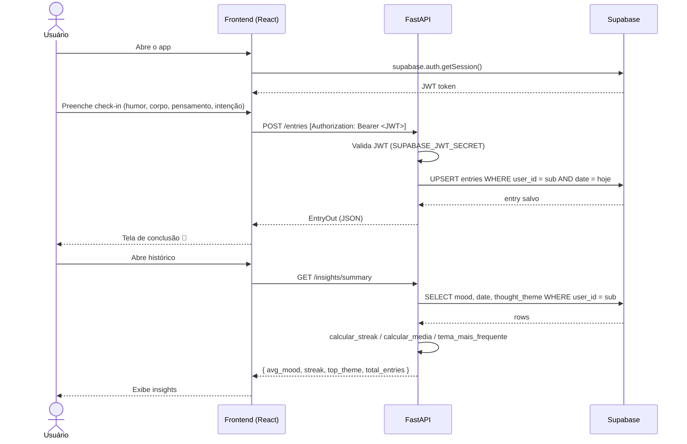

# Âncora — Mental Health Daily Check-in

App de check-in diário de saúde mental. Frontend React + backend FastAPI com Supabase.

## Arquitetura

```
Browser (React/Vite)
    │
    ├── src/services/api.js   ← camada de acesso a dados (API + fallback localStorage)
    │
    └──▶ FastAPI (Railway)
              │
              ├── /entries    ← check-ins diários
              ├── /insights   ← análises e tendências
              └── /users      ← perfil
                    │
                    └──▶ Supabase (PostgreSQL + Auth)
                              ├── RLS policies (LGPD)
                              └── JWT Auth
```

## Diagrama de sequência — fluxo de check-in



## Estrutura do projeto

```
ancora-mental-health/
├── src/                    # Frontend React + Vite
│   ├── screens/            # CheckIn, History, Onboarding, Completion
│   ├── hooks/              # useEntries, useUser
│   ├── services/
│   │   └── api.js          # Client HTTP com fallback localStorage
│   └── data/constants.js   # Opções de mood, corpo, temas
│
├── api/                    # Backend FastAPI
│   ├── routers/
│   │   ├── entries.py      # POST/GET /entries
│   │   ├── insights.py     # GET /insights/summary e /trend
│   │   └── users.py        # GET/POST /users/me
│   ├── models/             # Pydantic schemas
│   ├── services/
│   │   ├── supabase.py     # Cliente + middleware JWT
│   │   └── analytics.py    # streak, média, tendência 30 dias
│   ├── tests/              # pytest (31 testes, 93% cobertura)
│   ├── db/schema.sql       # DDL + RLS policies
│   ├── main.py
│   └── requirements.txt
│
└── .github/workflows/
    ├── test.yml            # pytest em todo PR
    ├── deploy.yml          # GitHub Pages (frontend)
    └── deploy-api.yml      # Railway (backend) no merge para main
```

## Como rodar localmente

### Pré-requisitos

- Node 20+
- Python 3.11+
- Conta no [Supabase](https://supabase.com)

### 1. Variáveis de ambiente

```bash
cp .env.example .env
# edite .env com suas credenciais do Supabase
```

### 2. Frontend

```bash
npm install
npm run dev
```

### 3. Backend

```bash
cd api
python -m venv .venv
source .venv/bin/activate
pip install -r requirements.txt
uvicorn api.main:app --reload
```

A API sobe em `http://localhost:8000`. Documentação interativa em `http://localhost:8000/docs`.

### 4. Banco de dados

Execute `api/db/schema.sql` no SQL Editor do seu projeto Supabase para criar as tabelas e as RLS policies.

### 5. Testes

```bash
# na raiz do projeto
PYTHONPATH=. pytest api/tests/ -v --cov=api
```

## Variáveis de ambiente

| Variável | Onde usar | Descrição |
|---|---|---|
| `VITE_API_URL` | Frontend | URL base da API (ex: `https://api.railway.app`) |
| `SUPABASE_URL` | Backend | URL do projeto Supabase |
| `SUPABASE_SERVICE_ROLE_KEY` | Backend | Chave service-role (nunca expor no frontend) |
| `SUPABASE_JWT_SECRET` | Backend | Secret para validar JWTs do Supabase Auth |
| `RAILWAY_TOKEN` | GitHub Actions | Token de deploy no Railway |

## Deploy

- **Frontend**: GitHub Actions → GitHub Pages (automático no push para `main`)
- **Backend**: GitHub Actions → Railway (automático quando arquivos em `api/` mudam no `main`)
